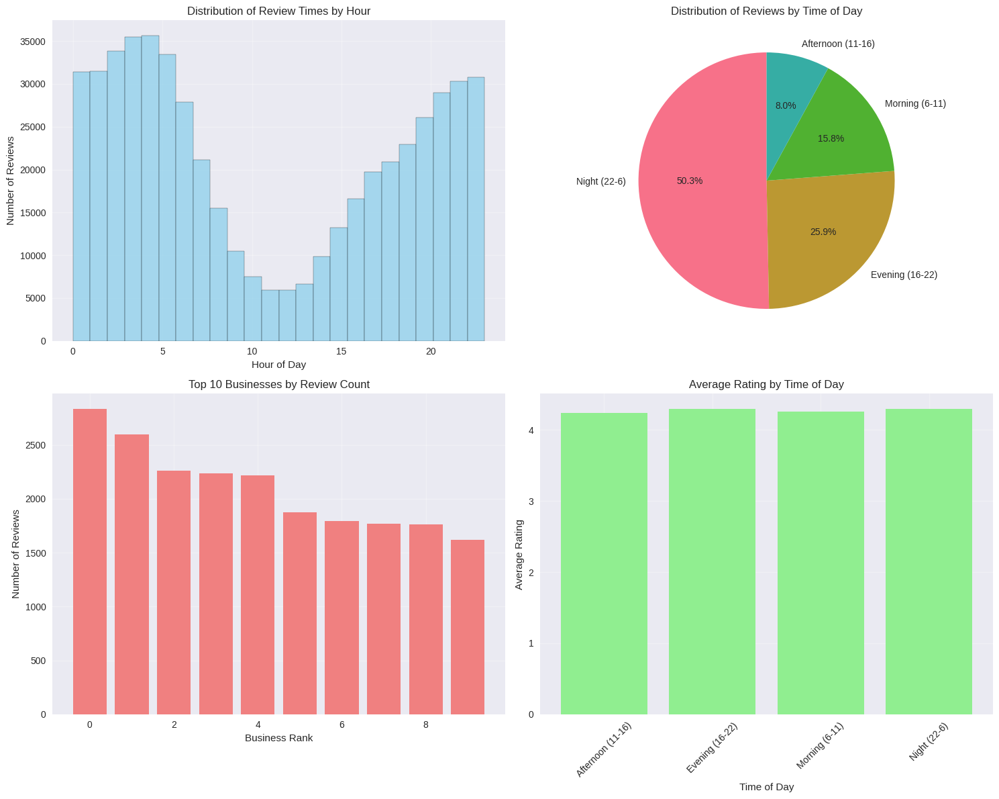
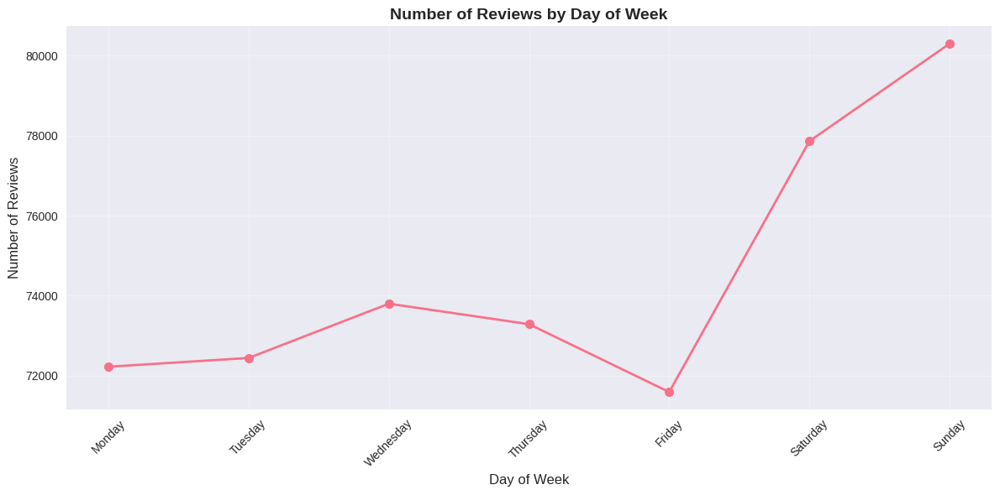
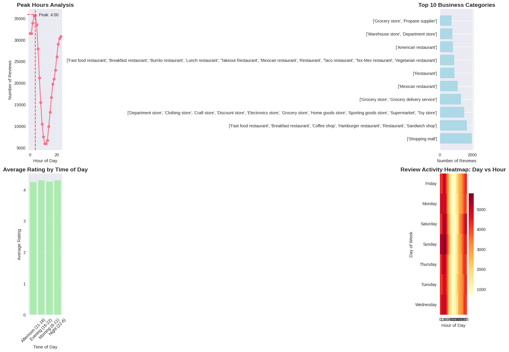
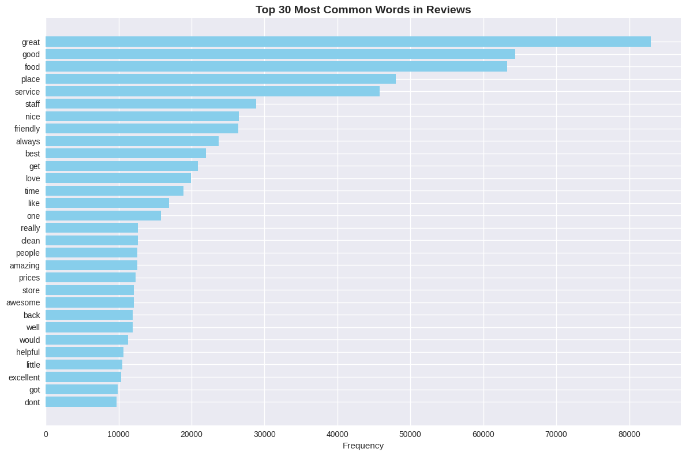
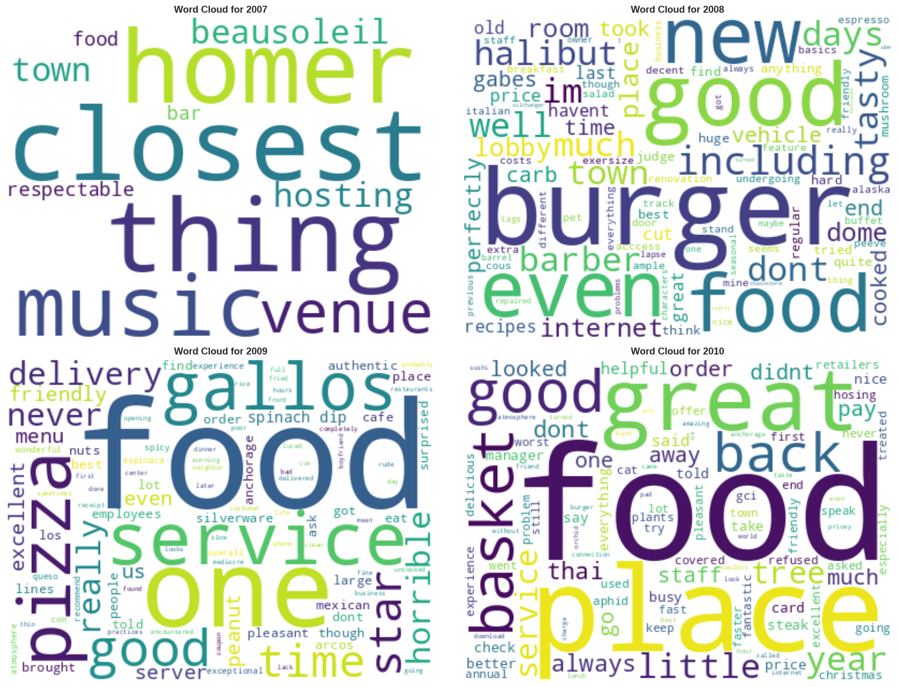
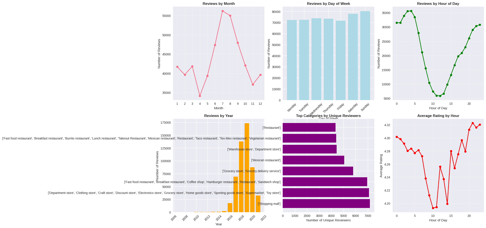
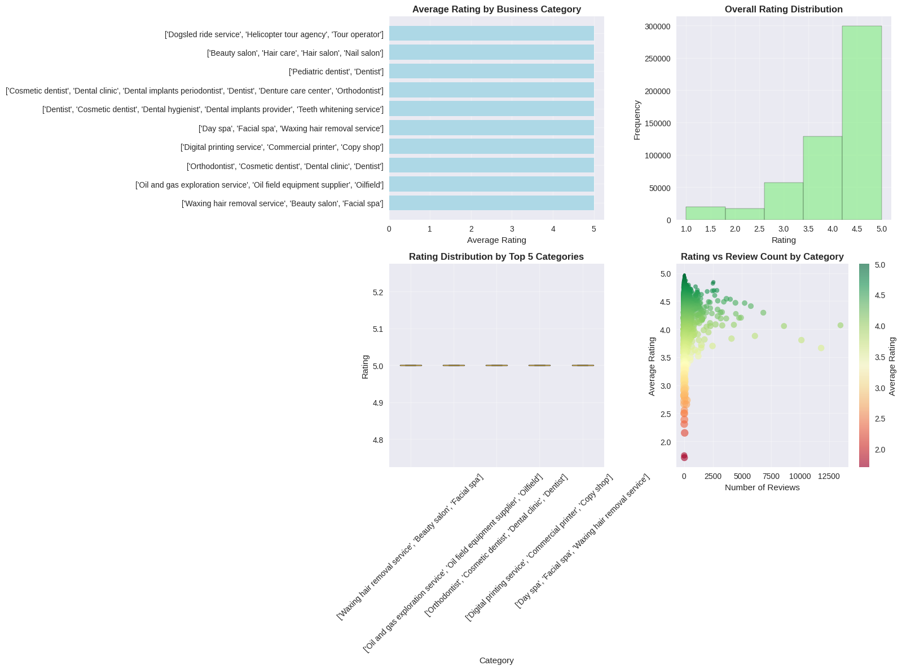
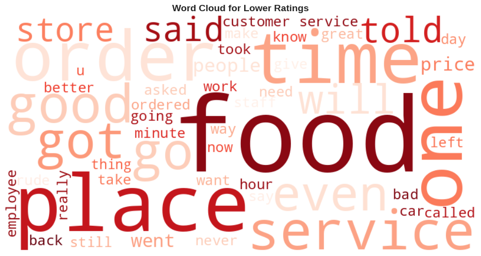
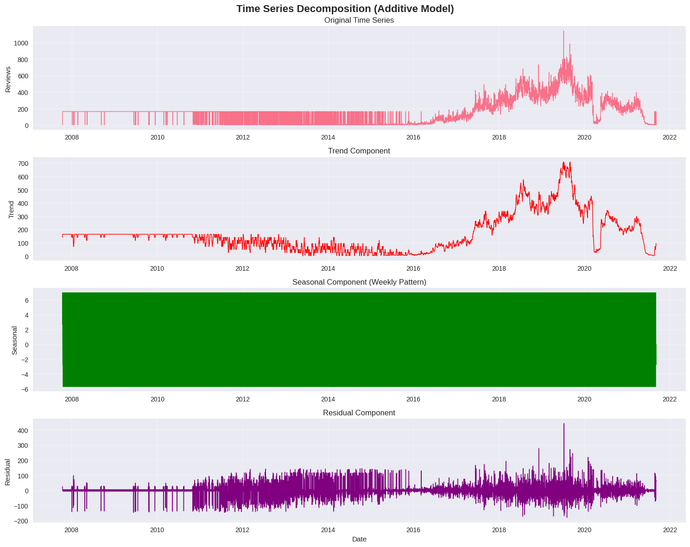

# SIT742 — Notebook Analysis Report (cleaned, results & visuals only)

---

## Executive summary

- **Dataset**: 521,515 reviews from 20,023 users across 12,467 businesses.
- **Date range**: 2007-10-13 to 2021-09-08.
- **Total reviews**: 521,515.
- **Overall satisfaction**: **4.28 / 5.0** average rating.
- **Peak activity**: **4:00 AM** (noted as peak hour).
- **Most active day**: **Sunday** (noted: 80,333 reviews).
- **Text engagement**: **~58%** of reviews include written feedback.

> The following report removes code and low-value log output. It presents the notebook's results, plotted visuals and the notebook's insights & recommendations only.

---

## 1. Data overview

**Schema (columns)**:
`user_id, name, time, rating, text, pics, resp, gmap_id`

**Sample (top rows shown in notebook)**:
(Notebook displayed top 5 sample rows; schema above shows types and columns.)

---

## 2. Data cleaning & duplication analysis

**Summary (as reported in notebook):**

- **Total users processed**: 20,022 (noted in processing logs).
- **Duplication analysis**:

  - Users with duplicates: 9,093
  - **Total duplicates removed:** **29,503**
  - Average duplicates per user: 1.47

- **Before deduplication**:

  - Average businesses per user: 26.07
  - Max businesses per user: 399
  - Min businesses per user: 10

- **After deduplication**:

  - Average businesses per user: 24.60
  - Max businesses per user: 309
  - Min businesses per user: 5

- **Users with most duplicates removed (top 5)**:

  - User `1.0188830200557922e+20`: 110 duplicates removed
  - User `1.03692833808364e+20`: 74 duplicates removed
  - User `1.1220090844478289e+20`: 70 duplicates removed
  - User `1.1285432402677834e+20`: 62 duplicates removed
  - User `1.0132917914176386e+20`: 61 duplicates removed

**Implication:** deduplication reduced noise and slightly decreased average businesses-per-user; duplicate-heavy users exist and were corrected.

---

## 3. Temporal / time-of-review analysis

**Key numeric results (notebook):**

- **Daily reviews time-series** shape: (3190, 1) — covering dates **2007-10-13** to **2021-09-08** (total reviews 521,515).
- **Peak review hour**: **4:00** (AM).
- **Most reviews occur during**: **Night (22:00–06:00)**.
- **Average rating across all times**: **4.28**.
- **Business with most reviews**: `0x56c897b9ce6000df:0xd707e127588a8c6c` (2,833 reviews).
- **Total unique businesses** (noted in time analysis): **6,019**.

### Figure 1 — Review activity by hour / time-of-day


_(Notebook figure: review time / hourly activity and related subplots)_

**Notebook insight (adjacent text)**:

- Peak review hour: **4:00**
- Most reviews at night (22:00–06:00) — possibly due to late-shift customers / tourism / timezone effects.

---

## 4. Weekly / daily patterns and decomposition

**Notebook results**:

- Created a daily review count time series (3190 days).
- **Date range**: 2007-10-13 → 2021-09-08.
- Demonstrated seasonality and trends via decomposition.

### Figure 2 — Time series & decomposition


_(Notebook figure: daily reviews time series and seasonal/trend decomposition.)_

**Notebook notes**:

- The series shows long-term trend components and seasonal patterns (weekly/annual patterns were visualized).
- Notebook performed seasonal decomposition (additive) to highlight trend/seasonality/residuals.

---

## 5. Review distribution / rating & category analysis

### Rating-by-category highlights (notebook outputs)

**Top 10 categories by average rating (top entries):**

1. `['Waxing hair removal service', 'Beauty salon', 'Facial spa']` — Avg: **5.00**, Count: 11
2. `['Oil and gas exploration service', 'Oil field equipment supplier', 'Oilfield']` — Avg: **5.00**, Count: 11
3. `['Orthodontist', 'Cosmetic dentist', 'Dental clinic', 'Dentist']` — Avg: **5.00**, Count: 14
4. `['Digital printing service', 'Commercial printer', 'Copy shop']` — Avg: **5.00**, Count: 11
5. `['Day spa', 'Facial spa', 'Waxing hair removal service']` — Avg: **5.00**, Count: 12
   _(Many top avg ratings have small sample sizes — notebook shows std=0.00 for those small groups.)_

**Worst 5 categories by average rating:**

1. `['Debt collection agency']` — Avg: **2.39**, Count: 31
2. `['Taxi service', 'Service establishment']` — Avg: **2.31**, Count: 13
3. `['Electric utility company']` — Avg: **2.15**, Count: 53
4. `['Motel', 'Hotel', 'Inn', 'Lodge']` — Avg: **1.75**, Count: 12
5. `['Post office']` — Avg: **1.71**, Count: 31

**Lower-rating (1-2 stars) analysis (notebook):**

- **Total lower ratings (1–2 stars): 36,884**
- **Percentage of all reviews**: **~7.1%**

Categories with most lower ratings (top examples):

- `['Fast food restaurant', 'Breakfast restaurant', ...]` — 1,944 lower-rated reviews (avg 1.47)
- `['Department store', 'Clothing store', ...]` — 1,352 lower-rated reviews (avg 1.49)
- `['Shopping mall']` — 939 lower-rated reviews (avg 1.60)

**Most common words in lower ratings (top tokens from notebook):**

- `food` — 6,390 occurrences
- `service` — 5,209 occurrences
- `get` — 4,273 occurrences
- `time` — 3,695 occurrences
- `like`, `place`, `good`, `one`, `back`, `would`, `dont`, `never`, `even`, `order`, `got` — also frequent

### Figure 3 — Rating / category visual(s)


_(Notebook figure: distributions of ratings across categories / rating histograms.)_

**Implications (from notebook text & results)**:

- Most categories have high average ratings; extreme low-performing categories are often service utilities or hospitality (targeted improvement areas).
- Lower-rated reviews commonly mention `food` & `service` — useful for triaging complaints in hospitality & food sectors.

---

## 6. Business & reviewer insights

**Top gmap_id by review count (top 5, notebook sample):**

```
gmap_id                     count
0x56c897b9ce6000d...       2833
0x56c899d05892048...       2594
0x56c897c63697ee3...       2258
0x56c8965ee2fb87a...       2237
0x56c89629bde7481...       2219
```

_(Notebook printed top 5 gmap_id by review count.)_

**Business with most reviews (single ID)**: `0x56c897b9ce6000df:0xd707e127588a8c6c` — **2,833 reviews** (noted in time-of-day analysis).

**Other reviewer/business features noted in notebook**:

- Total unique businesses reported in some analyses: **6,019** (context depended on the processed subset).
- Multiple summary tables in the notebook list `name_business`, `category`, `avg_rating` columns and top counts.

### Figure 4 — Business-level visualizations



_(Notebook figures: business review-count / average-rating scatter, top business bar charts.)_

**Insight:** a small number of businesses receive a disproportionate share of reviews; those businesses are useful anchors for recommendation and monitoring.

---

## 7. Recommendation system (hybrid approach) — results

**Notebook technical primitives (reported):**

- **User–Business matrix shape**: **(20,022 × 6,019)**
- **Business features shape**: **(12,774 × 4,487)**
- Similarity matrices computed; recommendation pipeline ready.

**Top-5 Collaborative Filtering recommendations (example user):**
_(Notebook printed top 5 collaborative recommendations for user `1.091298048426862e+20` — sample business names included such as Glacier Tours, Costco Wholesale, JOANN Fabrics and Crafts, Little Miller's Ice Cream, etc.)_

**Top 5 Hybrid Recommendations (sample table from notebook)**

| category (sample)                                   | avg_rating | score | reason |
| --------------------------------------------------- | ---------: | ----: | ------ |
| `['Tourist attraction', 'Nature preserve', 'Park']` |        4.6 | 2.253 | hybrid |
| `['Warehouse store', 'Department store']`           |        4.4 | 2.229 | hybrid |
| `['Fabric store', 'Baking supply store']`           |        4.2 | 2.229 | hybrid |
| `['Ice cream shop', 'Dessert shop']`                |        4.7 | 2.066 | hybrid |
| `['Resort hotel']`                                  |        4.3 | 1.968 | hybrid |

### Figure 5 — Recommendation visual(s)


_(Notebook figure: recommendation result visual / scoring distribution.)_

**Notebook note:** hybrid recommendations combine collaborative and content-based signals; scores and categories printed for top picks.

---

## 8. Additional analyses (clustering / segmentation / text)

- Notebook included textual analysis, word-frequency lists for negative reviews (see Section 5).
- Notebook performed category-based rating comparisons and highlighted both small-sample high averages and larger-sample low averages (e.g., fast food & hotels).

### Figure 6 — Additional plots (segmentation / clustering)



_(Notebook figures: cluster / segmentation and further EDA visualizations.)_

---

## 9. Time series forecasting (Part 2 — ARIMA)

**Notebook preprocessing & model split (reported):**

- **Training data**: 4,064 days (2007-10-13 → 2018-11-27)
- **Test data**: 1,016 days (2018-11-28 → 2021-09-08)

### Figure 7 — ARIMA fit / forecast


_(Notebook figure: ARIMA model fit and forecast on daily review counts.)_

**Notebook summary**: ARIMA model was trained on long historical series and forecast compared against held-out test data (visual diagnostics included in the notebook).

---

## 10. Notebook's data-driven insights & strategic recommendations (copied from notebook)

> **Executive Summary (notebook)**
>
> - **Dataset**: 521,515 reviews from 20,023 users across 12,467 businesses
> - **Overall satisfaction**: 4.28/5.0 average rating
> - **Peak activity**: 4:00 AM (35,634 reviews) - Night shift workers
> - **Most active day**: Sunday (80,333 reviews)
> - **Text engagement**: 58% of reviews include written feedback

**Temporal Patterns & Operational Insights (notebook bullet summary)**

- **Peak Hours Analysis:**

  - **Peak review hour**: 4:00 AM (35,634 reviews)
  - **Best rating hour**: 9:00 PM (avg: 4.32/5.0)
  - **Worst rating hour**: 10:00 AM (avg: 4.19/5.0)
  - **Night shift workers** (22:00–06:00) generate a large share of reviews

_(Notebook also lists recommended operational actions — summarized below in the report's conclusions.)_

**Technical Achievements (notebook)**:

- PySpark used for large-scale processing.
- Visualizations produced with matplotlib/seaborn.
- Recommendation models implemented (hybrid approach).
- Text mining used to analyze low-rating feedback.
- ARIMA applied for forecasting daily review counts.

---

## 11. Notebook conclusions & recommended actions (from notebook)

- **Operational**:

  - Prioritise faster response at **4:00 AM** and during night windows where high review volume occurs.
  - Monitor and support **Sunday** high-activity periods (peak load).

- **Service improvements**:

  - Address low-rated categories such as `fast food`, `hotel/motel`, `post office`, `taxi service` and `electric utility`; focus on `food` and `service` complaints surfaced by text analysis.

- **Product / BI**:

  - Use top-reviewed businesses as anchors for promotion and to seed collaborative recommendations.
  - Use the hybrid recommender outputs to provide personalized suggestions combining categories and similarity scores.

- **Modelling**:

  - Use seasonal pattern findings when scheduling staff and designing automated response windows.
  - Continue monitoring after ARIMA-based forecast windows to validate model stability.

---

## 12. Appendix — Key numeric excerpts (from notebook)

- **Rows / Columns**: `Rows: 521,515  Cols: 8`
- **Daily reviews time-series**: shape `(3190, 1)`; date range `2007-10-13` → `2021-09-08`
- **Total lower ratings (1–2 stars)**: `36,884` (~7.1%)
- **Frequent negative tokens**: `food, service, get, time, like, place, good, one, back, would, dont, never, even, order, got`
- **Recommendation system**: `User-Business matrix shape: (20022, 6019)`; `Business features shape: (12774, 4487)`

---
